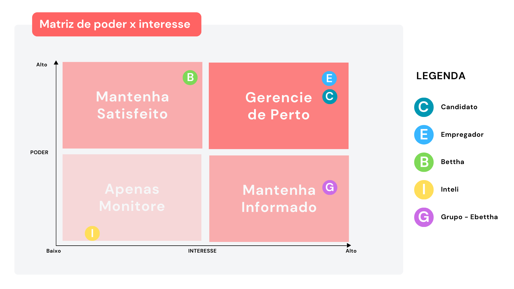

# Documentação Modelo Preditivo - Inteli

```
INSTRUÇÕES GERAIS (remova este trecho ao final)

Você deve editar este documento utilizando notação markdown - siga as convenções neste link
https://docs.github.com/en/get-started/writing-on-github/getting-started-with-writing-and-formatting-on-github/basic-writing-and-formatting-syntax
```

## Nome da Solução

### Nome do grupo

#### (preencha aqui os nomes dos integrantes, em ordem alfabética, separados por vírgula)

## Sumário

[1. Introdução](#c1)

[2. Objetivos e Justificativa](#c2)

[3. Metodologia](#c3)

[4. Desenvolvimento e Resultados](#c4)

[5. Conclusões e Recomendações](#c5)

[6. Referências](#c6)

[Anexos](#attachments)

## <a name="c1"></a>1. Introdução

&nbsp; &nbsp; &nbsp; O início de carreira é um momento muito tempestuoso na vida dos jovens. Isso porque programas de trainee podem chegar a ser quase 30 vezes mais concorridos do que entrar no curso mais disputado da Universidade de São Paulo, que apresenta uma proporção de 118 candidatos para cada vaga. É nesse contexto que entra em jogo a Bettha, uma empresa nascida em 2017 como braço direito do grupo Cia de Talentos e que visa preparar e desenvolver pessoas antes mesmo do processo seletivo para as empresas.

&nbsp; &nbsp; &nbsp; Outra questão que merece destaque é o fato do Brasil ser o país com o maior índice de turnover dentro das organizações, tendo o dobro da média mundial. Dessa forma, a empresa acaba perdendo o dinheiro investido no recrutamento. Para driblar essa realidade, a Bettha mapeia o perfil comportamental, aderência à cultura e conhecimentos específicos de cada candidato e gera um match entre vagas e participante. Assim, o desafio deste projeto é elevar o nível de assertividade desse match, ajudando na redução das taxas de turnover.

## <a name="c2"></a>2. Objetivos e Justificativa

### 2.1 Objetivos

```
Descreva resumidamente os objetivos gerais e específicos do seu parceiro de negócios.

Remova este bloco ao final
```

### 2.2 Proposta de solução

```
Descreva resumidamente sua proposta de modelo preditivo e como esse modelo pretende
resolver o problema, atendendo os objetivos.

Remova este bloco ao final
```

### 2.3 Justificativa

```
Faça uma breve defesa de sua proposta de solução, escreva sobre seus potenciais,
seus benefícios e como ela se diferencia.

Remova este bloco ao final
```

## <a name="c3"></a>3. Metodologia

```
Descreva as etapas da metodologia CRISP-DM que foram utilizadas para o
desenvolvimento, citando o referencial teórico. Você deve apenas enunciar
os métodos, sem dizer ainda como eles foram aplicados, nem quais
resultados foram obtidos.

Remova este bloco ao final
```

## <a name="c4"></a>4. Desenvolvimento e Resultados

### 4.1. Compreensão do Problema

#### 4.1.1. Contexto da indústria

```
Descreva os principais players, modelos de negócio e tendências acerca
dos modelos preditivos.

Remova este bloco ao final
```

#### 4.1.2. Análise SWOT

```
Posicione aqui sua análise SWOT.

Remova este bloco ao final
```

#### 4.1.3. Planejamento Geral da Solução

```
a) quais os dados disponíveis (fonte e conteúdo - exemplo: dados da
   área de Compras da empresa descrevendo seus fornecedores).
b) qual a solução proposta (pode ser um resumo do texto da Seção 2.2).
c) qual o tipo de tarefa (regressão ou classificação).
d) como a solução proposta deverá ser utilizada.
e) quais os benefícios trazidos pela solução proposta.
f) qual será o critério de sucesso e qual métrica será utilizada
   para avaliá-lo.

Remova este bloco ao final
```

#### 4.1.4. Value Proposition Canvas

&nbsp; &nbsp; &nbsp; O Canvas de Proposta de Valor desempenha um papel fundamental ao oferecer uma representação visual concisa dos principais elementos que compõem a proposta de valor de um produto ou serviço. Sua importância reside na capacidade de proporcionar clareza na definição das necessidades dos clientes, diferenciação competitiva, alinhamento interno, iteração estratégica e comunicação eficaz com stakeholders. Ao delinear segmentos de clientes, soluções oferecidas, vantagens competitivas e estrutura de custos, o Canvas orienta a tomada de decisões informadas e impulsiona a inovação, contribuindo assim para o desenvolvimento bem-sucedido e a evolução contínua do negócio.
Baseando-se nas funcionalidades oferecidas pelo produto e na análise da situação do cliente chegamos ao seguinte resultado:


<center>Fonte: Elaborado pelos autores</center>
&nbsp;

Lado do produto:

Criadores de ganho:

-Feedback de compatibilidade usuário x empresa:
  A solução fornecerá ao usuário um indicativo quantitativo referente à sua compatibilidade com as empresas indicadas.

-Melhores recomendações de trilhas a serem seguidas pelos usuários:
  Por meio do modelo preditivo, os usuários receberão recomendações mais precisas acerca de quais trilhas de aprendizado devem seguir.

Produtos & serviços:

-Modelo preditivo usuário x vagas x trilhas:
  Um modelo de análise de dados que providenciará matches precisos com empresas e trilhas baseando-se em dados de perfil dos usuários e das empresas.

Aliviadores de dores:

-Melhor aplicação dos dados coletados dos usuários:
  O modelo realizará uma utilização integral e inteligente dos dados coletados e fornecidos pela empresa parceira.

-Recomendações mais precisas:
  As recomendações retornadas pelo modelo serão precisas.

Lado do cliente:

Ganhos:

-Maior confiança entre a empresa e seus clientes:
  Com os resultados precisos do modelo a confiança dos clientes na Bettha irá aumentar.

-Maior popularidade da plataforma:
  Com recomendações mais precisas a Bettha se tornará mais popular no mercado em que atua.

Trabalhos a serem realizados:

-Entregar recomendações de trilhas e de gestores/empresas aos usuários:
  A proposta da Bettha é ligar usuários com trilhas de aprendizado e com propostas de emprego e estágio.

Dores:

-Baixa personalização no sistema de match:
  O sistema atual de match é genérico e não faz bom uso de todos os dados coletados dos usuários.

-Interface de usuário:
  A plataforma possui vários bugs e processos desgastantes na realização de algumas tarefas.


#### 4.1.5. Matriz de Riscos

&nbsp; &nbsp; &nbsp; A matriz de risco é uma ferramenta utilizada para identificar, avaliar e priorizar os riscos associados a um projeto, processo, ou qualquer atividade que envolva incertezas. Ela permite visualizar de forma organizada os possíveis eventos adversos que podem impactar o sucesso do projeto e ajuda a tomar decisões informadas para mitigar ou lidar com esses riscos.

&nbsp; &nbsp; &nbsp; Com base nos impactos e nas probabilidades de ocorrência, os riscos foram classificados em quatro categorias: baixa, média, alta e muito alta. A partir disso, foi possível montar a matriz de riscos, que pode ser listada abaixo:

Riscos:

-Desentendimentos entre o grupo:
  Engloba todas as possibilidades de desentendimento entre membros do grupo. O risco é considerado moderado devido às diferentes maneiras de solucioná-los. A probabilidade é alta porque desentendimentos ocorrem a todo momento pelos mais diversos motivos.

-Atraso de entrega:
  O grupo não conseguiu finalizar os artefatos dentro do prazo estipulado. O risco é 
  baixo visto que os membros estão comprometidos com o projeto, entretanto o 
  impacto é extremamente alto visto que as entregas valem nota e refletem o.
  andamento total do projeto

-Falta de clareza das informações do parceiro:
  Falha do parceiro ao comunicar as informações necessárias para a realização do projeto. Consideramos o risco baixo tendo em vista o contato inicial com o parceiro, entretanto o impacto é extremamente alto haja vista que um projeto baseado nas informações erradas pode sair completamente do escopo.

-Fuga do escopo do projeto:
  O projeto não seguiu o que foi proposto pelos parceiros. Consideramos o risco extremamente baixo, entretanto o impacto seria extremamente negativo considerando que o projeto não seria útil ao parceiro.

-Falta dos integrantes:
  Falta por parte dos integrantes do grupo tem uma chance moderada de acontecer haja vista que imprevistos acontecem. O impacto entretanto tende a não ser tão grande, principalmente se for devidamente comunicada.

-Incompatibilidade autoestudos/projeto:
  É comum que o conteúdo dos autos de estudos não seja suficiente ou pertinente com os conhecimentos necessários para o desenvolvimento do projeto. O impacto disso é alto visto que muitas vezes o conhecimento é buscado em outras fontes, nem sempre confiáveis. 

-Irresponsabilidade com as tarefas atribuídas:
  O risco é moderado e a probabilidade de 30% por que pode acontecer dos 
  integrantes do grupo se comprometerem com as atividades e não realizá-las, isso 
  pode acontecer mas a probabilidade é baixa dado que nós como um grupo vamos 
  nós monitorar e nos ajudar sempre.

-VIA falhar:
  O risco é alto e a probabilidade de 50% por que o Via vem falhando constantemente quando precisamos dele então optamos por instalar o software do via nos computadores para não ocorrer de falhar quando precisarmos apresentar.

-Falhas de hardware:
  Falhas no hardware de algum membro não costumam ocorrer com muita frequência e seu impacto é baixo também tendo em vista que existem diversas formas de resolver esse tipo de situação.

-Faltas em dia de apresentação:
  Faltas não avisadas em dia de apresentação são raras visto que os membros do grupo sabem a importância que as apresentações têm. Estas, entretanto, podem ter um impacto moderado uma vez que a presença de todos os membros é extremamente importante para a moral do grupo.

-Falha no alinhamento de expectativas com o parceiro:
  Isso ocorre quando há uma falha de comunicação e os parceiros esperam do projeto mais do que o grupo pretende entregar. O risco não é muito alto, entretanto o impacto e haja vista que essa situação pode gerar insatisfação por parte do parceiro.

-Falha de comunicação entre os membros:
  Falhas de comunicação entre os membros do grupo tem uma chance moderada de ocorrer, assim como um impacto moderado tendo em vista que pode ocasionar desentendimentos, tarefas feitas duas vezes e tarefas não feitas.

-Falta de sintonia scrum master/ equipe:
  Ocorre quando o scrum master não assume uma postura favorável ao bom desentendimento do grupo. A chance de ocorrer é baixa e o impacto também tendo em vista que o scrum master apenas atua por uma semana e que algumas situações podem ser resolvidas através de comunicação eficiente.


<center>Fonte: Elaborado pelos autores</center>


&nbsp; &nbsp; &nbsp; A partir da matriz de riscos, foi possível montar a tabela de gestão de riscos, que pode ser listada abaixo:


<center>Fonte: Elaborado pelos autores</center>

#### 4.1.6. Personas

&nbsp; &nbsp; &nbsp; O processo de definição das personas iniciou-se com a definição dos stakeholders. Para isso, pensou-se em quem seria afetado direta e indiretamente pelo desenvolvimento deste projeto. Assim, foi possível chegar na seguinte lista:

- Bettha: A própria empresa
- Candidatos: Jovens que encontram a Bettha enquanto procuram por experiência profissional;
- Empregadores: Empresas que contratam a Bettha para anunciar vagas;
- Inteli: A faculdade, que está interessada no desenvolvimento das soluções;
- Ebettha: Este grupo de desenvolvedores, que irá construir a solução.

&nbsp; &nbsp; &nbsp; Apesar de todas as partes mencionadas anteriormente serem impactadas com as atividades deste projeto, é necessário definir quem representará nossas personas. Dessa forma, conseguiremos mapear e entender as dores dos nossos usuários, levando à construção de uma solução que impacte, de fato, os utilizadores da plataforma da Bettha. Para isso, foi pensada numa matriz de poder x interesse, como pode-se ver abaixo.

<center>Figura xx - Matriz de poder x interesse</center>

<center>Fonte: Elaborado pelos autores</center>

#### 4.1.7. Jornadas do Usuário

```
Posicione aqui seus mapas de jornadas do usuário que utiliza o modelo.

Remova este bloco ao final
```

#### 4.1.8 Política de Privacidade

```
Posicione aqui sua política de privacidade em acordo com a LGPD

Remova este bloco ao final
```

### 4.2. Compreensão dos Dados

#### 4.2.1. Exploração de dados

```
Apresentar a estatística descritiva básica de cada coluna, identificar
se a coluna é numérica ou categórica e pelo menos 3 gráficos para
visualizar a relação entre colunas escolhidas pelo grupo.

Remova este bloco ao final
```

#### 4.2.2. Pré-processamento dos dados

```
Apresentar quais foram as ações realizadas de limpeza (tratamento de
missing values e remoção de outliers) e transformação (normalização
e codificação) das colunas.
Se houverem outliers, cite quais são e qual(is) correção(ões) será(ão)
aplicada(s).

Remova este bloco ao final
```

#### 4.2.3. Hipóteses

```
Descreva três hipóteses sobre a relação dos dados e o problema.
Justifique cada uma delas.

Remova este bloco ao final
```

### 4.3. Preparação dos Dados e Modelagem

```
Caso seu projeto seja Modelo Supervisionado, apresentar:
a) Modelagem para o problema (proposta de features com a explicação
   completa da linha de raciocínio).
b) Métricas relacionadas ao modelo (conjunto de testes, pelo menos 3).
c) Apresentar o primeiro modelo candidato, e uma discussão sobre os
   resultados deste modelo (discussão sobre as métricas para esse
   modelo candidato).

Caso seu projeto seja Modelo Não-Supervisionado, apresentar:
a) Modelagem para o problema (proposta de features com a explicação
   completa da linha de raciocínio).
b) Primeiro modelo candidato para o problema.
c) Justificativa para a definição do K do modelo.
d) Escolha de um tipo de sistema de recomendação e a justificativa
   para essa escolha.

Remova este bloco ao final
```

### 4.4. Comparação de Modelos

```
- Descrever e justificar a escolha da métrica de avaliação dos
  modelos com base no que é mais importante para o problema ao
  se medir a qualidade desses modelos;
- Descrever ao menos três modelos candidatos, seus respectivos
  algoritmos, seus tunings de hiperparâmetros e suas métricas
  alcançadas;

Remova este bloco ao final
```

### 4.5. Avaliação

```
- Descreva a solução final de modelo preditivo e justifique a escolha.
  Alinhe sua justificativa com a Seção 4.1, resgatando o entendimento
  do negócio e explicando de que formas seu modelo atende os requisitos
  e definições.
- Descreva também um plano de contingência para os casos em que o
  modelo falhar em suas predições.
- Além disso, discuta sobre a explicabilidade do modelo e realize a
  verificação de aceitação ou refutação das hipóteses.
- Se aplicável, utilize equações, tabelas e gráficos de visualização
  de dados para melhor ilustrar seus argumentos.

Remova este bloco ao final
```

## <a name="c5"></a>5. Conclusões e Recomendações

```
Escreva, de forma resumida, sobre os principais resultados do seu
projeto e faça recomendações formais ao seu parceiro de negócios em
relação ao uso desse modelo. Você pode aproveitar este espaço para
comentar sobre possíveis materiais extras, como um manual de usuário
mais detalhado na seção “Anexos”.
Não se esqueça também das pessoas que serão potencialmente afetadas
pelas decisões do modelo preditivo e elabore recomendações que ajudem
seu parceiro a tratá-las de maneira estratégica e ética.

Remova este bloco ao final
```

## <a name="c6"></a>6. Referências

PATI, Camila. 10 programas de trainee com mais de 400 candidatos por vaga. **Exame**. Disponível em: <https://exame.com/carreira/10-programas-de-trainee-com-mais-de-400-candidatos-por-vaga/>. Acesso em 04 de agosto de 2023.
Veja quais são os cursos mais concorridos para a USP em 2023; Medicina lidera. **Exame**. Disponível em: <https://exame.com/brasil/veja-quais-sao-os-cursos-mais-concorridos-para-a-usp-em-2023-medicina-lidera/>. Acesso em 04 de agosto de 2023.
Saiba mais sobre a empresa Bettha. **Bettha**. Disponível em: <https://www.bettha.com/quem-somos>. Acesso em 03 de agosto de 2023.
Invertemos a lógica do processo seletivo. **Bettha**. Disponível em: <https://www.bettha.com/empresa>. Acesso em 03 de agosto de 2023.

## <a name="attachments"></a>Anexos

```
Utilize esta seção para anexar materiais como manuais de usuário,
documentos complementares que ficaram grandes e não couberam no
corpo do texto etc.

Remova este bloco ao final
```
