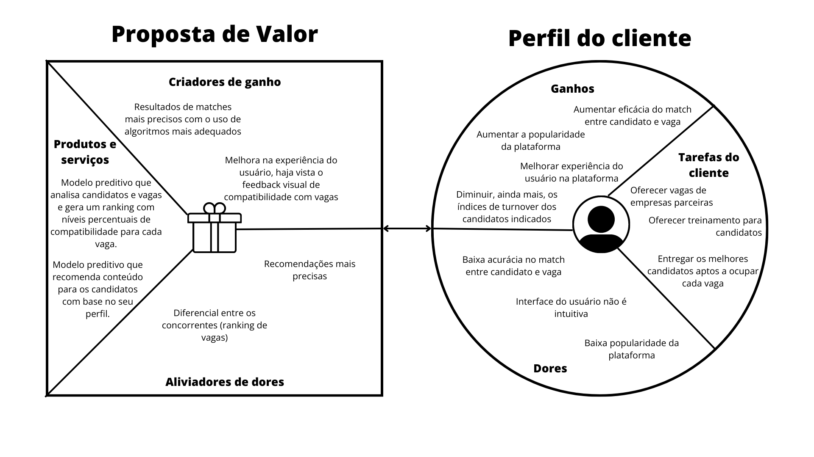

# Documentação Modelo Preditivo - Inteli

## Ebettha

### Ebettha

#### Eduarda Cardoso de Souza, Gabrielly Silva Vitor, Luan Ramos de Mello, Matheus Ribeiro dos Santos, Maurício de Azevedo Neto, Murilo de Souza Prianti Silva e Ólin Medeiros Costa.

## Sumário

[1. Introdução](#c1)

[2. Objetivos e Justificativa](#c2)

[3. Metodologia](#c3)

[4. Desenvolvimento e Resultados](#c4)

[5. Conclusões e Recomendações](#c5)

[6. Referências](#c6)

[Anexos](#attachments)

## <a name="c1"></a>1. Introdução

<div style="text-align: justify">

&emsp; O início de carreira é um momento muito tempestuoso na vida dos jovens. Programas de trainee, por exemplo, podem chegar a ser quase 30 vezes mais concorridos do que entrar no curso mais disputado da Universidade de São Paulo, que apresenta uma proporção de 118 candidatos para cada vaga. É nesse contexto que entra em jogo a Bettha, uma empresa nascida em 2017 como braço direito do grupo Cia de Talentos e que visa preparar e desenvolver pessoas antes mesmo do processo seletivo para ingressar no mercado de trabalho.

&emsp; Outra questão que merece destaque é o fato do Brasil ser o país com o maior índice de turnover dentro das organizações, apresentando o dobro da média mundial. Dessa forma, a empresa acaba perdendo o dinheiro investido no recrutamento. Para driblar essa realidade, a Bettha mapeia o perfil comportamental e conhecimentos específicos de cada candidato e gera um match (combinação entre duas ou mais partes com características compatíveis) entre vagas e participantes.

&emsp; Tal ação é positiva tanto para as empresas que estão ofertando vagas, quanto para os candidatos. Isso porque, primeiro, quem está concorrendo a determinado cargo, visualiza somente recomendações para ocupar funções que combinam com suas características, o que proporciona não só um aumento nas chances de ser aceito, como também eleva a probabilidade de permanecer no cargo em caso de contratação. Com isso, a organização tende a receber pessoas mais adeptas às características procuradas, ao passo que, reduz a temida taxa de turnover.

&emsp; Apesar de saber da relevância de oferecer essa funcionalidade em sua plataforma, a Bettha padece de uma baixa acurácia nos resultados desses matches. Nesse sentido, o principal desafio deste projeto é construir um modelo preditivo que seja capaz de aprimorar o nível assertividade da aplicação já existente, proporcionando uma melhor experiência tanto para quem está aplicando, quanto para quem oferece vagas na Bettha.

</div>

## <a name="c2"></a>2. Objetivos e Justificativa

&emsp; Neste tópico, serão explorados os objetivos deste projeto, bem como as justificativas que fundamentam o seu desenvolvimento. A seção está dividido em três partes distintas: "objetivos", que trata a respeito das metas a serem alcançadas com o trabalho desta equipe, "proposta de solução", na qual descreve sucintamente o que será desenvolvido e, por fim, "justificativa", cujo ponto focal é narrar a relevância em produzir a proposta de solução previamente esplanada.

### 2.1 Objetivos

<div style="text-align: justify">

&emsp; De maneira geral, este projeto visa garantir aos utilizadores da plataforma Bettha, uma melhor experiência durante o processo de recrutamento, assistindo desde os candidatos, até às instituições que disponibilizam vagas.

&emsp; É primordial entender que, acima de tudo, este projeto está sendo construído com fins didáticos. Dessa forma, a primeira meta diz respeito ao aprendizado dos integrantes deste trabalho, que será alcançado por cada membro com aulas presenciais, livros e videoaulas fornecidos pelo Inteli, bem como o desenvolvimento deste projeto. É possível considerar que ele foi atingido se, ao final das 10 semanas de duração do módulo, todos os membros conseguirem entender e reproduzir as etapas para a construção de um modelo preditivo.

&emsp; Para além disso, espera-se que, até a semana 04, o grupo tenha compreendido os dados fornecidos pela Bettha e realize qualquer tratamento que seja necessário. O êxito dessa tarefa pode ser medido a partir da capacidade da equipe em formular as primeiras hipóteses acerca das relações entre candidato e gestor de cada vaga, mas também entre candidato e trilhas de conhecimento. Essa etapa é importante pois somente com estas especulações o trabalho é capaz de avançar para a elaboração de um modelo inicial.

&emsp; Em seguida, será necessário escolher uma das hipóteses previamente elaboradas para que ela seja desenvolvida até a semana 06. O primeiro modelo deve ser capaz de trazer respostas para o problema definido e confirmar, ou refutar, aquilo que foi anteriormente presumido. Essa etapa necessitará de validação junto à Bettha e também servirá como base para o próximo objetivo.

&emsp; Depois, até a semana 08, têm-se a expectativa de estar com o projeto semi finalizado. Isso implicará que, dado o mapeamento comportamental de um candidato e uma lista que contenha o mapeamento de várias vagas, o modelo seja capaz de retornar, por ordem decrescente, e informando em valor percentual, a compatibilidade do concorrente para cada uma das funções. Nesta fase, o modelo também deverá ser capaz de fornecer, para cada candidato, recomendações de trilhas de conhecimento. Por fim, é esperado que todos estes resultados sejam apresentados em uma interface web agradável para melhor visualização do cliente quanto às atividades desenvolvidas.

&emsp; Após estas validações, o modelo desenvolvido será lapidado de tal forma que possa atender ao _feedback_ dado pelo cliente na apresentação anterior. Estas melhorias devem ser feitas até a data limite do projeto – o final da semana 10. Isso ocorrerá para que, na apresentação final, o time consiga entregar à Bettha um modelo que atenda às demandas anteriormente expostas neste documento.

&emsp; Cumprir todos estes objetivos é indispensável para atingir a última meta, que consiste na utilização do projeto aqui desenvolvido em um ambiente de produção na Bettha ou, quando menos, que ele sirva de alicerce para a implementação de um modelo de match mais eficaz do que o atualmente existente na sua plataforma.

</div>

### 2.2 Proposta de solução

&emsp; Assim como mencionado na introdução deste documento, a Bettha padece de um match entre candidato e vaga com baixa acurácia. Com isso em vista, a solução aqui proposta ataca diretamente esta fraqueza e consiste na elaboração de um modelo preditivo que seja capaz de mensurar numericamente, em um percentual de 0% a 100%, a compatibilidade de um candidato com cada uma das vagas ofertadas na Bettha.

&emsp; Além disso, estes resultados serão exibidos em formato de ranking, possibilitando ao usuário uma melhor identificação sobre qual vaga mais combina com seu perfil. Por fim, este projeto também propõe-se a fornecer recomendações personalizadas sobre quais jornadas de conhecimento cada candidato deve trilhar dentro da Bettha para que tenha mais chances de ser contratado por uma organização.

### 2.3 Justificativa

<div style="text-align: justify">

&emsp; O setor de recrutamento, no qual a Bettha atua, é um mercado extremamente concorrido. Assim sendo, é indispensável que ela apresente algum diferencial para que consiga convencer outras empresas a realizarem seus processos seletivos dentro da plataforma Bettha. Por isso, o desenvolvimento deste projeto entregará duas funcionalidades, as quais permitirão uma vantagem competitiva da Bettha frente aos seus concorrentes.

</div>

## <a name="c3"></a>3. Metodologia

```
Descreva as etapas da metodologia CRISP-DM que foram utilizadas para o
desenvolvimento, citando o referencial teórico. Você deve apenas enunciar
os métodos, sem dizer ainda como eles foram aplicados, nem quais
resultados foram obtidos.

Remova este bloco ao final
```

## <a name="c4"></a>4. Desenvolvimento e Resultados

&emsp; Nesta seção, serão apresentados todos os passos que foram necessários para desenvolver a solução proposta, bem como se deu o processo de análise para entender o problema apresentado pela Bettha e como a empresa se encaixa no ramo de recrutamento e seleção.

### 4.1. Compreensão do Problema

&emsp; Antes de adentrar no desenvolvimento do código que trará os resultados esperados, é necessário entender a fundo qual problema pretende-se resolver. Para isso, os próximos tópicos abordarão uma análise de negócios, desenvolvida analisando-se cenários internos e externos à Bettha, bem como uma investigação sobre a experiência do usuário. Estas etapas são importantes pois permitem entender quais as principais dores enfrentadas pelo cliente atualmente e fornecem _insights_ sobre como é possível resolvê-las.

#### 4.1.1. Contexto da indústria

&emsp; A Bettha atua no setor de recrutamento e seleção. Ao pensar nesta área, é comum lembrar de grandes nomes, tais quais Linkedin, Catho e Gupy. Tal coisa já é um forte indicativo de que este mercado se caracteriza como um oceano vermelho. Contudo, para que seja possível realizar uma investigação mais precisa, este grupo fez uma análise baseada nas 5 forças de Porter, estudando quem são os concorrentes atuais e potenciais da Bettha, bem como seus clientes, fornecedores e produtos que possam vir a substituí-la. Com isso, foi possível chegar na tabela mostrada a seguir, cuja explicação vem logo abaixo.

<p style="text-align: center">Tabela 01 - Análise da indústria na qual a Bettha está inserida</p>

| Força | Quem são? | Quais ameaças? | Quais as minhas possíveis reações? |
|:---:|:---:|:---:|:---:|
| Concorrentes atuais | Grupo 01: LinkedIn, Gupy e Catho. & Grupo 02: Cia de estágios, Matchbox, Across e Espro. | Grupo 01: Empresas que atuam no mesmo nicho e que podem ganhar preferência das empresas e usuários. & Grupo 02: Investimento pesado em marketing, o que pode acarretar na preferência das empresas e usuários. | Rebranding, implementação de novas tecnologias e investimento em marketing |
| Concorrentes potenciais | Becas Santander | Novas empresas/startups, ou até mesmo escolas e/ou fundações oferecerem os serviços gratuitamente para jovens em início de carreira. | Investir em marketing |
| Produtos substitutos | Trybe, Cubos Academy, Ada Tech Alura e Tera | Fornecem formação completa em tecnologia e, por terem parceria com diversas empresas, possuem um índice de empregabilidade. | Expandir relacionamento já existente com empresas parceiras para ofertar capacitação e garantir a geração de novos empregos. |
| Fornecedores | AWS, conexão com internet, energia e infraestrutura no geral | Vazamento de dados, instabilidade na hospedagem da plataforma, ataques hackers e indisponibilidade de serviços. | Diversificar o serviço de armazenamento e hospedagem em nuvem, investir em segurança de dados e buscar acordo em relação aos preços. |
| Clientes | Empresas e candidatos | Empresas anunciarem vagas em outras plataformas e, por consequência, os candidatos se cadastrarem em outros lugares. | Para empresas, criar planos para fidelizar e atrair o anúncio de vagas. Para usuários, recomendar trilhas de capacitação e melhorar a UX do site. |

<p style="text-align: center">Fonte: Elaborada pelos autores</p>

&emsp; Iniciando-se a análise pelos concorrentes atuais, verifica-se dois grandes grupos que se caracterizam como concorrência direta. O primeiro deles enquadram empresas como LinkedIn, Gupy e Catho, que já são muito consagradas no ramo e investem pesado em marketing. Isso pode fazer com que as empresas que oferecerão vagas tenham preferência por elas, deixando a Bettha em segundo plano.

&emsp; Para contornar essa situação, a Bettha deve, obviamente, investir em marketing e até mesmo passar por um processo de rebranding, mas isto não será suficiente. Ela deve apresentar algum recurso tecnológico que seja capaz de tornar todo o processo de recrutamento mais eficiente. A Gupy, por exemplo, utiliza inteligência artificial para selecionar os currículos que possuem mais chances de serem escolhidos para uma vaga. Utilizar métodos similares torna o processo de seleção mais barato, o que é atrativo para empresas que pretendem anunciar vagas.

&emsp; Além disso, existe um segundo grupo de empresas, formado pela Companhia de Estágios, Matchbox, Across e Espro, as quais atuam no mesmo nicho que a Bettha, oferecendo vagas para pessoas no início de carreira. Ainda que elas também não sejam tão conhecidas, alguma organização que pretenda oferecer vagas específicas em programas de estágio ou trainee pode dar preferência para essas outras empresas. Para minimizar esta ameaça, a Bettha deve seguir os mesmos procedimentos descritos no parágrafo anterior.

&emsp; Em seguida, tem-se a análise no que tange aos concorrentes potenciais. Atualmente, não existem tantas empresas que possam representar, futuramente, dor de cabeça para a Bettha. A fundação Becas Santander, pertencente ao banco Santander tem o objetivo de fornecer bolsas de estudos para pessoas que estão em início de carreira e, apesar de não ser o foco da plataforma, também oferece vagas de estágio. Se essa prática se consolidar, a fundação pode investir em parcerias para disponibilizar mais programas de estágios, representando um risco real para Bettha. Ademais, isso pode ser replicado por outras fundações e/ou escolas que queiram contribuir para a inclusão de jovens no mercado de trabalho.

&emsp; Assim como nos concorrentes diretos, para minimizar os efeitos destes riscos, é necessário que a Bettha invista em marketing para atrair o olhar de novas empresas que possam anunciar vagas em sua plataforma. Essas campanhas publicitárias também devem ter enfoque no usuário, pois, atualmente, 3% do tráfego do site é orgânico, enquanto todo o restante é fruto do redirecionamento de hotsites próprios das instituições que estão anunciando vagas.

&emsp; Posteriormente, observa-se os produtos substitutos. Hoje em dia, existem várias startups educacionais que representam ameaça à Bettha. A Trybe, por exemplo, oferta formação em programação na modalidade “Sucesso Compartilhado”. Isso significa que, enquanto o aluno está aprendendo, não é necessário efetuar nenhum pagamento. Contudo, quando ele é contratado por alguma empresa, ele começa a pagar a sua formação com parte do seu salário. Esse esquema é muito atrativo para quem está no início de carreira, principalmente porque, graças às parcerias que a Trybe firma, o seu índice de empregabilidade chega aos 92%. Outras empresas como Tera, Cubos Academy, Ada Tech e Alura possuem programas similares.

&emsp; Pensando em um jovem que está procurando sua primeira experiência profissional, é muito seduzente preferir um programa similar ao da Trybe do que ter que concorrer com outros milhares de candidatos por uma vaga, como acontece na Bettha. Por isso, é fundamental que a Bettha pense em estratégias para mitigar os danos que possam acontecer em função desse cenário. Se pensar que ela já possui parcerias com grandes empresas, tal qual a Google, o objetivo seria expandir essas colaborações para que a Bettha ofertasse uma formação mais consolidada e, com isso, pudesse entregar maiores taxas de empregabilidade, despertando interesse nos candidatos.

&emsp; Outrossim, é necessário também pensar nos fornecedores da Bettha. Estes, não são triviais de se elencar, haja vista que todos os seus serviços são digitais e eles não possuem fornecedores diretos de matéria prima. Nesse sentido, fornecedores mensuráveis são a Amazon Web Services (AWS), responsável por hospedar a plataforma, bem como armazenar todos os dados coletados dos usuários e todos os demais fornecedores estão relacionados à infraestrutura do prédio, como provedor de internet e luz.

&emsp; Logo, as principais ameaças são relativas ao meio tecnológico, como a indisponibilidade dos serviços da AWS, que impediria o acesso à plataforma Bettha. Além disso, considerando a quantidade de dados pessoais e sensíveis armazenados, um ataque hacker que levasse ao vazamento desses dados poderia causar o pagamento de multas milionárias por infringir a Lei Geral de Proteção de Dados Pessoais (LGPD). Segurança nunca é demais e, por isso, a Bettha precisa investir em segurança digital se não quiser que estas ameaças não se tornem um problema. Além disso, buscar diversificar os serviços de hospedagem da sua plataforma, garantindo que, caso um provedor fique indisponível, o outro possa assumir o tráfego para que o acesso ao site da Bettha não fique interrompido.

&emsp; Por fim, para analisar os clientes, foi feita uma divisão em duas partes: as empresas que ofertam vagas e os candidatos. Já que 97% dos acessos na Bettha correspondem ao redirecionamento de hotsites de outras empresas, a principal ameaça seria a preferência dessas instituições por outros serviços de recrutamento, o que levaria a perda de acesso dos usuários.

&emsp; Nesse sentido, é necessário que a Bettha crie planos que possam fidelizar clientes que já anunciam vagas na sua plataforma, bem como estes programas possam atrair novos clientes. Com isso, os usuários continuariam sendo atraídos para a plataforma. Entretanto, para garantir que o candidato goste do site, é necessário rever a interface, haja vista que ela é muito poluída e não é tão intuitiva.
Uma síntese dessa discussão pode ser observada na matriz de 5 forças de Porter na imagem abaixo.

<div style="text-align: center">Figura 01 - 5 forças de porter - Bettha</div>

<div style="text-align: center">Fonte: Elaborado pelos autores</div>

&emsp; Esclarecendo uma última vez:

- O poder de barganha dos fornecedores é alto, pois, além de existirem poucos players capazes de hospedar grandes aplicações, caso a Bettha queira trocar de um para outro, terá que abrir mão de serviços específicos daquela empresa;
- A ameaça de novos entrantes é alta, haja vista que a barreira de entrada no segmento é baixíssima;
- A ameaça de produtos substitutos é média. Isso ocorre porque, como visto anteriormente, apesar de haverem métodos mais garantidos para se conseguir o primeiro emprego, muitas pessoas preferem seguir os métodos tradicionais de seleção oferecidos pela Bettha, logo, a ameaça não é alta, mas existe e pode causar dor de cabeça no futuro;
- O poder de barganha dos clientes é alto para a empresa e baixo para os candidatos. Assim como já mencionado na análise anterior, por haver várias empresas que realizam um trabalho igual ao da Bettha, as organizações podem oferecer vagas em qualquer outra plataforma. Contudo, o candidato fica refém da Bettha no momento em que a vaga que ele quer está anunciada no site. Além disso, ele não tem poder suficiente para escolher se candidatar para aquela vaga em outro site.
- Finalmente, a rivalidade entre concorrentes é alta, haja vista que existem vários players competindo por pequenas quotas do mercado.

#### 4.1.2. Análise SWOT

&emsp; Na análise SWOT, avalia-se os pontos fortes e fracos de uma empresa, observando o cenário externo à organização, assim como o cenário interno. Sua importância reside na de criação de um panorama geral da empresa, o qual permite avaliar e evidenciar situações que podem ser desfavoráveis para a empresa, possibilitando a tomada de decisões para conter o problema. Ela também é capaz de gerar insights acerca de como conquistar oportunidades existentes no mercado. Sabendo disso, este grupo realizou a referida análise, cujo resultado pode ser conferido na imagem abaixo.

<div style="text-align: center">Figura 02 - Análise SWOT - Bettha</div>

<div style="text-align: center">Fonte: Elaborado pelos autores</div>

&emsp; Agora, é necessário entender cada um dos pontos destacados. Iniciando-se pelas forças, do inglês “strengths”, onde foi analisado todos os pontos positivos da organização que colocam ela à frente de outras organizações do mesmo setor. Além disso, estes são pontos que dependem da Bettha, ou seja, ela tem influência e consegue interferir. Enumera-se:

- Grande base de dados e experiência no mercado: A Bettha possui uma boa quantidade de dados robustos, que agregam valor à empresa e auxiliam na construção de um serviço mais fidedigno. Além de anos de experiência de mercado, ambos provenientes do tempo que esteve vinculado à “Companhia de Talentos”.
- Parceria com grandes empresas: Visto que os clientes da Bettha são as empresas, essas parcerias com grandes empresas consolidadas no mercado para a oferta de vagas (Como a Red Bull, Nestlé, Mondelez, Even) são essenciais para o seu crescimento, pois auxiliam na divulgação do serviço como algo positivo e confiável. Além disso, a Bettha possui parcerias nas quais disponibilizam cursos profissionalizantes para os usuários, como no caso do programa “Transforma”, junto à Google.
- Oferta de treinamentos gratuitos: A plataforma da Bettha possui um grande diferencial que é a oferta de conteúdos profissionalizantes para usuários. A disponibilidade de tais materiais possui como objetivo o desenvolvimento profissional e preparo dos consumidores para que possam conquistar e se adequar às respectivas vagas de interesse.
- Forte relacionamento com empresas: A Bettha possui uma política de acompanhamento de seus clientes (até mesmo depois do preenchimento da vaga solicitada) por meio de feedbacks, o que demonstra comprometimento e passa uma maior confiabilidade para com a empresa contratante.
- Suporte aos usuários: Utilizando as suas ferramentas (Genius, Lifestyle, Workstyle), a Bettha oferece serviços para os candidatos que ajudam a mapear o seu perfil e apresentar vagas onde eles se enquadram melhor, além de planos para desenvolvimento.
- Escolha de público alvo: A Bettha possui como público alvo de pessoas que estão ingressando no mercado de trabalho, preenchendo uma lacuna -visto que outras empresas rivais oferecem um serviço mais generalizado- e fornecendo suporte para essa iniciação.
- Baixa rotatividade nos candidatos indicados: Segundo análises feitas, após a contratação realizada por empresas utilizando os serviços da Bettha, a taxa de desligamento desses funcionários posteriormente é baixa, possuindo um turnover de 0 nos 6 primeiros meses.

&emsp; Ainda no ambiente interno, existem as fraquezas, do inglês “weaknesses”, onde avaliou-se os pontos fracos da Bettha e que podem acabar dando vantagem aos seus concorrentes.

- Baixo reconhecimento na área: A Bettha se encontra em um mercado de alta concorrência e, por possuir um marketing discreto e pouco atuante, não adquire tanto reconhecimento pelas pessoas como outras plataformas mais consolidadas e utilizadas.
- Vulnerabilidade a ataques e indisponibilidade: Considerando que o serviço da Bettha é oferecido majoritariamente de forma online, as chances de haver prejuízos caso haja alguma queda no sistema de hospedagem, bugs no site, problemas no armazenamento do seu banco de dados ou ataques cibernéticos existe e seus impactos são altos.
- Interface não intuitiva: A interface da Bettha não é tão simples de ser utilizada devido a quantidade de informações presentes. Em decorrência disso, muito tempo é gasto pelo usuário para concluir sua aplicação para a vaga efetivamente.
- Acurácia do match entre candidato e vaga: Apesar de exibir a opção de “vagas recomendadas”, estas nem sempre condizem com a realidade, haja vista que o nível de acurácia desse serviço é consideravelmente baixo.

&emsp; Em seguida, têm-se as oportunidades, tradução de “opportunities”, as quais mensuram acontecimentos externos ao ambiente da empresa, mas que podem ser aproveitados por ela para expandir e/ou melhorar seus serviços.

- Aumento na demanda de vagas no Brasil: O alto índice de desemprego no país acaba refletindo na maior procura por vagas, que podem ser anunciadas na Bettha.
- Maior integração de inteligências artificiais no mercado: A normalização da utilização de inteligências artificiais seria uma oportunidade para que a Bettha implemente essa tecnologia nos seus serviços, mas sem perder a credibilidade.
- Inexperiência dos candidatos: Considerando que o público alvo da Bettha são pessoas em início de carreira e, considerando ainda que estas geralmente não entendem sobre o mercado de trabalho, a Bettha pode se valer desse fato para atrair novos candidatos e oferecê-los suas trilhas de formação.
- Programas de inclusão e diversidade: Apesar da Bettha focar em um público mais jovem, cada vez mais empresas estão procurando reinserir pessoas com faixa etária mais elevada no mercado de trabalho. E a Bettha já realizou este tipo de serviço uma vez. Assim, seria uma oportunidade se mais empresas conseguissem encontrar a Bettha para realizar esse tipo de recrutamento, permitindo uma expansão da empresa.

&emsp; Finalmente, nas ameaças, do inglês “threats”, foram abordados os aspectos ainda externos à empresa, mas que podem ser prejudiciais ao seu desenvolvimento.

- Alta competitividade: Muitas empresas hoje oferecem um serviço semelhante ao da Bettha, o que pode ser uma ameaça por exigir sempre inovações para se destacar no mercado.
- Mudança na preferência dos usuários: Pode ser que os candidatos busquem outras possibilidades para encontrar sua primeira experiência profissional, como na Trybe, mencionada no tópico anterior de análise da indústria.
- Demanda por funcionários experientes: Muitas empresas clamam por funcionários com bastante experiência em suas áreas de atuação. Isso porque eles são capazes de resolver problemas mais complexos ao mesmo tempo em que geram menos custos do que contratar várias pessoas inexperientes. Nesse sentido, o número de vagas para estagiários e trainees pode decair, culminando na menor oferta de vagas pela Bettha.
- Facilmente replicado por outra empresa: Os produtos da Bettha podem ser replicados e, devido ao marketing mais agressivo de outros rivais no mercado, se tornarem obsoletos.

#### 4.1.3. Planejamento Geral da Solução

&emsp; Os dados disponíveis foram coletados diretamente pela Bettha através dos testes de mapeamento de perfil disponibilizados na sua plataforma. Numericamente, são 850 mil resultados referentes ao preenchimento de candidatos e 2 mil resultados referentes ao preenchimento dos mesmos testes, mas pelos gestores das vagas. Eles servirão como base para construir um modelo preditivo, caracterizado por utilizar regressão, que possa relacionar candidato e vaga, gerando um número que representa a compatibilidade do usuário com aquela vaga e listando, por ordem decrescente, estes cargos para o candidato.

&emsp; Esta solução deverá ser implementada diretamente no site de vagas da Bettha, e trará benefícios tanto para as empresas quanto para os usuários. As empresas se beneficiarão por possuírem mais uma métrica a respeito da compatibilidade de um candidato com sua vaga. Além disso, também receberão candidatos mais qualificados, haja vista que o benefício, para o usuário, é ter noção das suas chances de ser aceito e, com isso, aplicar para as vagas que mais condizem com seu perfil e trabalhar nas habilidades para tentar vagas mais destoantes.

&emsp; Para avaliar a eficácia desse modelo, existem duas métricas principais. A primeira, depende diretamente do feedback de cada usuário da plataforma. Após receber seu nível de compatibilidade com uma vaga, o candidato poderá avaliar se concorda com o resultado, sendo que a sua resposta irá variar desde “discordo totalmente” até “concordo totalmente”. Essa métrica é importante, inclusive, pois ajuda o modelo a reaprender suas recomendações. A segunda métrica está relacionada com o índice de turnover dos candidatos indicados pela Bettha. Se a taxa continuar 0 por um período maior do que 6 meses, pode-se concluir que o modelo foi eficaz.

#### 4.1.4. Value Proposition Canvas

<div style="text-align: justify">

&emsp; O Canvas de Proposta de Valor desempenha um papel fundamental neste projeto, ao oferecer uma representação visual concisa dos principais elementos que compõem a proposta de valor de um produto ou serviço. Sua importância reside na capacidade de proporcionar clareza na definição das necessidades dos clientes, diferenciação competitiva, alinhamento interno, iteração estratégica e comunicação eficaz com stakeholders. Ao delinear segmentos de clientes, soluções oferecidas, vantagens competitivas e estrutura de custos, o Canvas orienta a tomada de decisões informadas e impulsiona a inovação, contribuindo assim para o desenvolvimento bem-sucedido e a evolução contínua do negócio.

&emsp; Assim, baseando-se na análise feita sobre a Bettha, bem como na solução a ser desenvolvida neste projeto, foi possível chegar ao resultado exibido abaixo.

<div style="text-align: center">Figura 03 - Value Proposition Canvas Ebettha</div>

<div style="text-align: center">Fonte: Elaborado pelos autores</div>

&emsp; Para melhor entendimento, é necessário aprofundar-se em cada um dos indicadores mencionados. Iniciando a análise

&emsp; Iniciando a análise pelo perfil do cliente, as “tarefas do cliente” são todas as coisas que a Bettha precisa fazer em suas atividades cotidianas. Aqui, foram elencados os tópicos que se seguem:

- Oferecer vagas de empresas parceiras: Sendo esse o core business da Bettha, ela trabalha diretamente com recrutamento e seleção e deve ofertar todas as vagas de empresas que buscam o seu serviço.
- Oferecer treinamento para os candidatos: Um dos diferenciais da Bettha é fornecer treinamento para que os usuários consigam aprender antes mesmo de serem contratados.
- Por fim, entregar os melhores candidatos aptos a ocupar cada vaga: Não basta somente mostrar que existem vagas abertas, o principal desafio da Bettha é entregar para cada instituição os melhores candidatos que aplicaram para ocupar aquela posição.

&emsp; Em seguidas, existem as dores do cliente, que são resultados negativos, problemas ou características não desejadas encontradas na realização das tarefas. Aqui, elenca-se:

- Baixa acurácia no match entre candidato e vaga: Considerando que eles desejam fornecer os melhores candidatos para cada vaga, a baixa acurácia ao recomendar vagas para os usuários faz com que a Bettha receba inscrições de usuários que sequer são compatíveis com aquela vaga.
- Interface do usuário não é intuitiva: Existem muitos elementos expostos de uma vez só na tela, o que leva o usuário a não entender direito onde encontrar a informação que ele deseja.
- Baixa popularidade da plataforma: Por ser uma empresa relativamente nova e que não investe em marketing, a popularidade da Bettha depende do anúncio nos sites de empresas parceiras que estão anunciando vagas.

&emsp; Finalizando o lado do cliente, existem os ganhos, que são resultados e/ou benefícios que o cliente espera ter para alavancar seu negócio. Nesta análise, aponta-se:

- Aumentar eficácia do match entre candidato e vaga: Isso resolve diretamente uma dor mostrada anteriormente.
- Aumentar a popularidade da plataforma: Também resolve uma dor mencionada anteriormente.
- Melhorar experiência do usuário na plataforma: Também está diretamente ligada à solução de uma dor exposta previamente.
- Diminuir, ainda mais, os índices de turnover dos candidatos indicados: Atualmente, nenhum candidato indicado pela Bettha sai da empresa nos primeiros 6 meses. A expectativa é aumentar esse tempo para 12 meses.

&emsp; Agora, entra em vigor a análise sobre a proposta de valor, isto é, a solução proposta por este grupo e como ela se relaciona com o perfil do cliente. Iniciando pelos produtos e serviços, esta equipe propõe-se a desenvolver um modelo preditivo que seja capaz de, dado um candidato e uma lista de vagas, ele seja capaz de fornecer um ranking com a medição, em porcentagem, da compatibilidade entre o usuário e a vaga. Além disso, esse modelo deve sugerir jornadas de aprendizado baseadas no perfil do candidato em questão.

&emsp; Em seguida, existem os aliviadores de dores. Estes devem se relacionar com as dores mencionadas no perfil do cliente, embora não haja a obrigatoriedade de resolver todas elas.

- Recomendações mais precisas: Com a construção do modelo preditivo aqui proposto, as recomendações de vagas e trilhas de aprendizagem serão melhores adequadas ao perfil de cada um dos indivíduos.
- Diferencial entre os concorrentes: Considerando que o serviço de ranking de compatibilidade entre candidato e vaga não existe em nenhuma outra plataforma, possuir esse diferencial poderia aliviar a dor da baixa popularidade da Bettha, pois seria um recurso que a colocaria à frente de seus rivais.

&emsp; É importante ressaltar que a dor relacionada à interface do usuário não pode ser solucionada através desta solução. Aliás, isso nem era pretendido, afinal, faz parte de uma seara fora do escopo deste projeto.

&emsp; Por fim, têm-se os criadores de ganho, os quais mostram de que forma a solução proposta entrega os ganhos esperados pelo cliente. Assim como nos aliviadores de dores, não há obrigação de entregar aquilo que o cliente espera. Todavia, ao contrário do caso anterior, todos os ganhos solicitados serão entregues.

- Matches mais precisos: Utilizando os algoritmos certos, será possível aumentar a eficácia entre o match, esperado pelo cliente, assim como poderá ajudar na redução dos índices de turnover, pois as empresas receberão, de fato, os melhores candidatos. Esse diferencial também pode auxiliar na popularização da plataforma.
- Melhora na experiência do usuário: Ao fornecer um ranking que mostra sua compatibilidade com cada uma das vagas, o usuário tem noção de qual posição terá mais probabilidade de ser aceito. Além disso, também fornece insights sobre quais competências ele deve desenvolver para aumentar sua compatibilidade. Isso melhora não só a experiência do usuário, como também ajuda a promover a popularidade da plataforma, justamente por apresentar um diferencial.

</div>

#### 4.1.5. Matriz de Riscos

&emsp; A matriz de risco é uma ferramenta utilizada para identificar, avaliar e priorizar os riscos associados a um projeto, processo, ou qualquer atividade que envolva incertezas. Ela permite visualizar de forma organizada os possíveis eventos adversos que podem impactar o sucesso do projeto e ajuda a tomar decisões informadas para mitigar ou lidar com esses riscos.

&emsp; Com base nos impactos e nas probabilidades de ocorrência, os riscos foram classificados em quatro categorias: baixa, média, alta e muito alta. A partir disso, foi possível montar a matriz de riscos, que pode ser listada abaixo.

<div style="text-align: center">Figura 04 - Matriz de riscos - Projeto Ebettha</div>

<div style="text-align: center">Fonte: Elaborado pelos autores</div>

&emsp; É importante entender como se deu a avaliação para posicionar cada um dos riscos e oportunidades. Em relação aos riscos:

- Desentendimentos entre o grupo: Engloba todas as possibilidades de desentendimento entre membros do grupo. O risco é considerado moderado devido às diferentes maneiras de solucioná-los. A probabilidade é alta porque desentendimentos ocorrem a todo momento pelos mais diversos motivos.

- Atraso de entrega: O grupo não conseguiu finalizar os artefatos dentro do prazo estipulado. O risco é baixo visto que os membros estão comprometidos com o projeto, entretanto o impacto é extremamente alto visto que as entregas valem nota e refletem no andamento total do projeto

- Falta de clareza das informações do parceiro: Falha do parceiro ao comunicar as informações necessárias para a realização do projeto. O risco é considerado baixo tendo em vista o contato inicial com o parceiro, entretanto o impacto é extremamente alto haja vista que um projeto baseado nas informações erradas pode sair completamente do escopo.

- Fuga do escopo do projeto: Significa que o projeto não seguiu o que foi proposto pelos parceiros. Consideramos o risco extremamente baixo, entretanto o impacto seria extremamente negativo considerando que o projeto não seria útil ao parceiro.

- Ausência dos integrantes: Diz quanto ao não comparecimento integrantes do grupo. Há uma chance moderada de acontecer haja vista que imprevistos ocorrem. O impacto, entretanto, tende a não ser tão grande, principalmente se a ausência for devidamente comunicada.

- Incompatibilidade autoestudos/projeto. É comum que o conteúdo dos autoestudos não seja suficiente e/ou pertinente com os conhecimentos necessários para o desenvolvimento do projeto. O impacto disso é alto visto que muitas vezes o conhecimento é buscado em outras fontes, nem sempre confiáveis.
- Irresponsabilidade com as tarefas atribuídas: Diz respeito a um membro do grupo não cumprir com as atividades que foram a ele atribuídas. A probabilidade de acontecer é baixa, haja vista o autogerenciamento do grupo, mas o impacto é moderado pois atrasa o andamento do projeto.
- Via falhar: Refere-se ao sistema de projeção de tela não funcionar para apresentar o conteúdo desenvolvido ao cliente. Tem probabilidade moderada de acontecer, pois o sistema ainda é muito instável, ao passo que o impacto é alto, pois existem dados visuais que não são contemplados com um pitch puramente oral.

- Falhas de hardware: Trata da ocorrência de problemas nos notebooks dos membros do grupo. A probabilidade é baixa, considerando-se o histórico de acontecimento dessa situação, bem como o impacto também, pois a equipe técnica do Inteli consegue solucionar esse impasse com agilidade.

- Faltas em dia de apresentação: Faltas não avisadas em dia de apresentação são raras visto que os membros do grupo sabem a importância que as apresentações têm. Estas, entretanto, podem ter um impacto moderado uma vez que a presença de todos os membros é extremamente importante para a moral do grupo.

- Falha no alinhamento de expectativas com o parceiro: Isso ocorre quando há uma falha de comunicação e os parceiros esperam do projeto mais do que o grupo pretende entregar. O risco não é baixo, haja vista o contato inicial com o parceiro, entretanto o impacto é alto, pois esta ação pode gerar insatisfação para com o cliente.

- Falha de comunicação entre os membros: Falhas de comunicação entre os membros do grupo tem uma chance moderada de ocorrer, bem como um impacto moderado, pois pode ocasionar desentendimentos, tarefas refeitas e/ou não entregues.

- Falta de sintonia scrum master/equipe: Ocorre quando o scrum master não assume uma postura favorável ao bom desenvolvimento do grupo. A chance de ocorrer é baixa e o impacto também tendo em vista que o scrum master apenas atua por uma semana e que algumas situações podem ser resolvidas através de comunicação eficiente.

&emsp; Além disso, existem também as oportunidades, que são eventos que podem acontecer em decorrência do projeto e que serão benéficas para as partes envolvidas.

- Aprendizados durante o módulo: Uma vez que os membros do grupo estarão focados em desenvolver esta solução, a probabilidade de ocorrer é muito alta, assim como o impacto.
- Networking com a empresa: Considerando que estabelecer um bom networking é fundamental para garantir emprego em algumas situações, a possibilidade de fazer networking com o cliente tem um impacto muito alto para os membros do grupo, enquanto que a probabilidade de fica em torno dos 50% pois não se sabe, ainda, quanto de abertura o cliente dará.
- Implementação do projeto criado: Será atingido se a Bettha escolher esta solução para implementar em produção na sua plataforma. Ao mesmo tempo em que a probabilidade é muito baixa, haja vista que este projeto trata-se de um MVP, o impacto seria muito alto pois significaria uma enorme conquista e forma de reconhecimento para o grupo.
- Superar as expectativas com o projeto: Diz respeito a encantar o cliente parceiro e entregar mais do que ele esperava. Possui não só uma probabilidade alta, pois as expectativas do parceiro são razoavelmente baixas, considerando que a solução será desenvolvida por alunos, como um impacto alto, pois conquistar clientes é fundamental para se destacar no mercado de trabalho.
- Por fim, o relacionamento entre o grupo tem uma probabilidade moderada de acontecer, pois, ainda que os membros da equipe convivam diariamente, estes nem sempre estão em sintonia. Além disso, o impacto também é moderado, pois manter relações saudáveis no ambiente de trabalho é fundamental.

&emsp; Por fim, de posse de todos os riscos, é necessário pensar no gerenciamento deles. Isto pode ser conferido na tabela abaixo.

<p style="text-align: center">Tabela 02 - Gestão de riscos</p>

| Risco | Responsável | Abordagem | Explicação |
|---|---|---|---|
| Desentendimento entre o grupo | Scrum Master | Reduzir e mitigar | O scrum master da semana deve utilizar das técnicas de comunicação não violenta para garantir que desentendimentos entre o grupo não causem danos significativos no desenvolvimento do projeto |
| Atraso na entrega | Maurício | Evitar | Para que não haja atraso na entrega de artefatos, o responsável deve estar atento com as datas de entrega, bem como do andamento de cada artefato. |
| Falta de clareza das informações do parceiro | Eduarda | Terceirizar | O responsável deve contatar o professor orientador, comunicar sobre as informações que estão fazendo falta para o grupo e esperar a resposta do parceiro para que possa prosseguir nas atividades que antes estavam impedidos de dar prosseguimento. |
| Fuga do escopo do projeto | Maurício | Evitar | É necessário estar sempre alinhado com o que o parceiro espera. Por isso, o responsável deve garantir coletar o feedback em cada entrega. |
| Falta dos integrantes | Murilo | Evitar | O responsável deve atentar-se às faltas dos integrantes para tomar as medidas cabíveis. Entender a causa dessa situação permitirá ajudar o membro em questão, assim como o grupo como um todo. |
| Incompatibilidade autoestudo x projeto | Maurício | Terceirizar | O membro deve comunicar sempre aos professores e coordenadores responsáveis sobre a ineficácia do material fornecido para que o problema possa ser solucionado a tempo. |
| Irresponsabilidade com as tarefas atribuídas | Scrum Master | Evitar | O scrum master deve estar sempre ciente do andamento de todas as tarefas de cada integrante para garantir que nenhuma atividade não seja entregue e/ou executada a tempo. |
| Via falhar | Ólin | Terceirizar | O membro deverá comunicar ao IT Bar do Inteli para solucionar o problema. |
| Falhas de Hardware | Todos os membros | Terceirizar | No caso de algum equipamento falhar, o integrante afetado deverá levá-lo até o IT Bar para a devida correção. |
| Faltas em dia de apresentação | Todos os membros | Evitar | Garantir que não existam faltas no dia de apresentação sem aviso prévio. |
| Falha no alinhamento de expectativas com o parceiro | Luan | Evitar | Garantir que as promessas feitas junto ao parceiro possam ser entregues pelo grupo. |
| Falta de comunicação entre os membros | Gabrielly | Reduzir e mitigar | É inevitável haver problemas de comunicação entre os membros. Contudo, o responsável deverá se atentar para que estes problemas não impeçam o avanço do projeto. |
| Falta de sincronia scrum master x equipe | Scrum master da semana anterior | Mitigar | O scrum master anterior deve se atentar para que, caso o atual não desempenhe um bom papel, ele consiga intervir para que o grupo funcione plenamente. |
<p style="text-align: center">Fonte: Elaborada pelos autores</p>

#### 4.1.6. Personas

&emsp; O processo de definição das personas iniciou-se com a definição dos stakeholders. Para isso, pensou-se em quem seria afetado direta e indiretamente pelo desenvolvimento deste projeto. Assim, foi possível chegar na seguinte lista:

- Bettha: O cliente
- Candidatos: Jovens que encontram a Bettha enquanto procuram por experiência profissional;
- Empregadores: Empresas que contratam a Bettha para anunciar vagas;
- Inteli: A faculdade, que está interessada no desenvolvimento das soluções;
- Ebettha: Este grupo de desenvolvedores, que irá construir a solução.

&emsp; Apesar de todas as partes mencionadas anteriormente serem impactadas com as atividades deste projeto, é necessário definir quem representará as personas. Dessa forma, será possível mapear e entender as dores dos nossos usuários, levando à construção de uma solução que impacte, de fato, os utilizadores da plataforma da Bettha.
&emsp; Para isso, foi pensada numa matriz de poder x interesse, a qual mapeia o nível de poder, isto é, o nível de capacidade de um agente intervir no resultado de determinada ação, mas também o interesse, ou seja, o quão aquela parte está interessada nos resultados do desenvolvimento de um projeto e será impactada por tais. O resultado pode ser visualizado abaixo.

<center>Figura 05 - Matriz de poder x interesse</center>

<center>Fonte: Elaborado pelos autores</center>

&emsp; O empregador é a peça que mais detém poder, uma vez que são os principais clientes da Bettha e, por isso, a plataforma deve atender aos seus pedidos. Além disso, esta também é a parte mais interessada no desenvolvimento de novas ferramentas que agreguem valor.  
&emsp; Em seguida, tem-se o candidato. Ele detém o mesmo nível de interesse que as empresas empregadoras, haja vista que representam o usuário da Bettha e estão em constante contato com a plataforma. Contudo, seu poder é um pouco mais baixo do que o dos empregadores, pois o candidato ainda depende do anúncio da vaga, cujo controle está nas mãos das empresas.  
&emsp; Também existe a Bettha que também detém o poder de avançar ou recuar na implementação de novas funcionalidades. O seu nível de interesse pode ser considerado intermediário. Isso não significa que ela possua menos interesse que os outros stakeholders. Contudo, na matriz, também estamos avaliando quem é impactado diretamente com os resultados, e esse peso recai mais fortemente nos usuários e empregadores.  
&emsp; Logo após, entra o Inteli, que não exerce poder sobre as tomadas de decisão do projeto, mas possui um pouco de interesse no seu desenvolvimento, haja vista que eles estarão atrelados à imagem da faculdade.  
&emsp; E, por fim, este grupo de desenvolvedores, denominados Ebettha, possui um nível de interesse alto em ver o modelo preditivo funcionando, mas o seu nível de poder é consideravelmente baixo, tendo em vista que só poderão intervir em regras de negócio sem tanta relevância dentro do código.  
&emsp; Assim, utilizando essa matriz, foi possível observar que os stakeholders a serem gerenciados de perto são o candidato e o empregador e, por isso, eles representarão as personas desenvolvidas neste trabalho.  
&emsp; A primeira persona chama-se Rafael Tambosi, de 19 anos, aluno do terceiro ano de ciência da computação na USP. Ele conheceu a Bettha quando precisou aplicar para uma vaga, mas não conseguiu ser aceito. Suas principais dores incluem não possuir as soft skills necessárias para ser aceito, bem como não saber exatamente qual vaga combina com ele. Com base nisso, foi possível montar um mapa de empatia e estruturar a persona fisicamente, como pode ser visto nas figuras 06 e 07.

<center>Figura 06 - Matriz de empatia: Rafael Tambosi</center>

<center>Fonte: Elaborado pelos autores</center>

<center>Figura 07 - Persona: Rafael Tambosi</center>

<center>Fonte: Elaborado pelos autores</center>

&emsp; A segunda persona é Natália Mafra, de 24 anos e graduada em Web Design pela FIAP. Ela conheceu a Bettha por acaso, mas nunca aplicou para nenhuma vaga na plataforma. Ela também estagiou no mercado financeiro, mas não gostou da experiência. Suas dores estão relacionadas a temer a cultura da empresa onde irá trabalhar, assim como problemas de comunicação. Seu mapa de empatia e representação visual estão abaixo.

<center>Figura 08 - Matriz de empatia: Natália Mafra</center>

<center>Fonte: Elaborado pelos autores</center>

<center>Figura 09 - Persona: Natália Mafra</center>

<center>Fonte: Elaborado pelos autores</center>

&emsp; Por fim, o Wagner Peixoto representa a terceira persona. Ele tem 37 anos e é Tech Lead no Spotify, mas iniciou sua carreira como estagiário no Banco Votorantim, enquanto cursava Engenharia da Computação na USP. Suas dores estão relacionadas a não concordar com a seleção que o RH faz quanto aos estagiários que ficarão sob sua responsabilidade, bem como dificuldade em se relacionar com jovens sem ambição. O mapa de empatia e persona podem ser vistos abaixo.

<center>Figura 10 - Matriz de empatia: Wagner Peixoto</center>

<center>Fonte: Elaborado pelos autores</center>

<center>Figura 11 - Persona: Wagner Peixoto</center>

<center>Fonte: Elaborado pelos autores</center>

#### 4.1.7. Jornadas do Usuário

&emsp; Neste tópico, será abordado o mapa de jornada do usuário, que consiste em uma representação visual das etapas pelas quais um usuário passa ao interagir com uma plataforma, destacando as emoções e ações que o usuário tem ao interagir com ela. Ele ajuda a identificar pontos de melhoria bem como entender as dores enfrentadas pelo usuário. Abaixo, é possível identificar o mapa de jornada de Natália Mafra, caso ela venha a se candidatar na Bettha.

<center>Figura 12 - Mapa de jornada do usuário: Natália Mafra</center>

<center>Fonte: Elaborado pelos autores</center>

#### 4.1.8 Política de Privacidade

&emsp; A ER52 TECNOLOGIA, CAPACITAÇÃO E SELEÇÃO LTDA, doravante chamada Bettha, pessoa jurídica de direito privado, com sede na R. Cap. Antônio Rosa, 409 - Jardim Paulistano, São Paulo - SP, 01443-010, inscrita no CNPJ/MF sob o n.º 24.679.785/0001-39, Startup do Grupo Cia de Talentos e uma das primeiras HR-Tech do Brasil a integrar a educação a processos de RH, leva a sua privacidade a sério e zela pela segurança e proteção de dados de todos os seus clientes, parceiros, fornecedores e usuários do site “https://www.bettha.com/” e qualquer outro site.  
&emsp; Os dados pessoais do Usuário são armazenados em uma plataforma que engloba os currículos cadastrados tanto via www.ciadetalentos.com.br (hospedados na plataforma ATS Globe) quanto via www.bettha.com (hospedados na plataforma Bettha). Isso significa que os dados são mantidos em duas plataformas distintas: ATS Globe e Bettha, dependendo da origem do currículo do usuário.  
&emsp; Os dados pessoais dos usuários são mantidos pelo Grupo Cia de Talentos (GCT) durante o período necessário para o desenvolvimento de processos de recrutamento e seleção, bem como para fins comerciais legítimos e essenciais. A política de retenção dos dados pessoais é detalhada na seção "Conservação e eliminação de dados".  
&emsp; A retenção dos dados pessoais ocorre por diversos motivos, incluindo a manutenção do desempenho da plataforma, tomada de decisões empresariais baseadas em dados, comprimento de obrigações legais, resolução de disputas e problemas não resolvidos relacionados à conta do usuário. A política também permite que o GCT elimine ou anonimize os dados pessoais a pedido do usuário, exceto quando a legislação exigir a retenção.  
&emsp; O GCT utiliza o termo "cookies" para englobar diversas tecnologias, incluindo cookies propriamente ditos, visando melhorar a experiência dos usuários. Isso inclui personalização de preferências, oferta de conteúdo específico, análise de comportamento e anúncios direcionados. Os cookies utilizados na Bettha incluem cookies primários e de terceiros, cookies de sessão e cookies persistentes. Além disso, web beacons, pixels e tags também são empregadas para anúncios relevantes e eficazes.  
&emsp; Os dados são coletados de diversas fontes, incluindo informações fornecidas pelos próprios usuários, bem como de terceiros como o LinkedIn, Gmail e Facebook. Os dados coletados são utilizados para personalizar a experiência do usuário na plataforma, recomendar conteúdo adaptado, oferecer anúncios personalizados, analisar comportamentos, aprimorar a plataforma, se comunicar com os usuários e cumprir obrigações legais.  
&emsp; Os dados coletados incluem: Fotografias e vídeos do usuário, informações sobre pessoa com deficiência, localização precisa do dispositivo, comandos de voz coletados via microfone, nome completo, CPF, e-mail, telefone, escolaridade, áreas de interesse, idiomas e localização.  
&emsp; Medidas de segurança são implementadas para proteger os dados pessoais contra acesso não autorizado, destruição, perda, alteração e outras formas de tratamento inadequado.  
&emsp; Os usuários têm direitos de acesso, correção, anonimização, exclusão, portabilidade e revogação do consentimento. O GCT fornece um canal de contato para esclarecimentos e exercício desses direitos.  
&emsp; Em caso de dúvidas sobre a política, os usuários podem entrar em contato com o Responsável pela Proteção de Dados por meio do e-mail lgpd@grupociadetalentos.com.br ou via correspondência no endereço que se segue: GRUPO CIA DE TALENTOS, Avenida das Nações Unidas, No. 12901, CENU Torre Norte, 11º andar, sala 11-133, Brooklin Paulista, São Paulo (SP), Brasil, CEP 04578-000.

### 4.2. Compreensão dos Dados

#### 4.2.1. Exploração de dados

```
Apresentar a estatística descritiva básica de cada coluna, identificar
se a coluna é numérica ou categórica e pelo menos 3 gráficos para
visualizar a relação entre colunas escolhidas pelo grupo.

Remova este bloco ao final
```
Tendo em vista de que era necessário a elaboração dos gráficos para a visualização da relação entre as colunas, foi necessário a utilização da biblioteca `matplotlib.pyplot` para a criação dos gráficos. Junto com a biblioteca, também tivemos o entendimento através da estatística descritiva básica de cada coluna, identificando se a coluna é numérica ou categórica para poder analisar os dados e elaborar os gráficos que mais fazem sentido para a visualização dos dados.

Primeiro gráfico:
O gráfico de barras plota as 10 chaves mais frequentes e sua contagem correspondente. Cada barra representa uma chave e a altura da barra representa a contagem de ocorrências dessa chave. As etiquetas de texto acima das barras mostram o número exato de ocorrências. Esse tipo de gráfico ajuda a visualizar rapidamente as chaves mais frequentes nos dados.

Código: 
import pandas as pd
import matplotlib.pyplot as plt

##### Lendo dados de um arquivo CSV
df = pd.read_csv('prep_df_user_superfit.csv')

##### Contando as ocorrências de cada chave
key_counts = df['key'].value_counts()

##### Ordenando as chaves pela contagem de ocorrências em ordem decrescente
key_ranking = key_counts.sort_values(ascending=False)

##### Exibindo o ranking
print("Ranking das chaves que mais se repetem:")
print(key_ranking)

##### Plotando o gráfico
plt.figure(figsize=(12, 8))  # Ajuste o tamanho do gráfico conforme necessário
ax = key_ranking.head(10).plot(kind='bar')  # Exibe apenas as 10 chaves mais frequentes
plt.title('Top 10 chaves que mais se repetem')
plt.xlabel('Chave')
plt.ylabel('Contagem')

##### Adicionando etiquetas de texto com a contagem
for i, v in enumerate(key_ranking.head(10)):
    ax.text(i, v + 0.2, str(v), ha='center', va='bottom')

plt.show()

<div style="text-align: center">Figura 04 - Teste de hipótese 1 - Projeto Ebettha</div>

<div style="text-align: center">Fonte: Elaborado pelos autores</div>

Segundo gráfico:
O gráfico de barras cria uma visualização da frequência de cada valor único na coluna 'key' do DataFrame(base de dados fornecido pelo Bettha). Cada barra representa um valor único, e a altura da barra representa a frequência desse valor. A adição das contagens acima das barras ajuda a entender rapidamente quantas vezes cada valor aparece. Esse tipo de gráfico é útil para entender a distribuição de frequência dos diferentes valores em uma coluna categórica.

Código: 
import pandas as pd
import matplotlib.pyplot as plt

df = pd.read_csv('prep_df_user_superfit.csv')

##### Conta a frequência de cada valor único na coluna 'key'
key_counts = df['key'].value_counts()

##### Ordena os valores pela frequência, em ordem decrescente
key_counts = key_counts.sort_values(ascending=False)

##### Cria o gráfico de barras
plt.figure(figsize=(10, 6))
plt.bar(key_counts.index, key_counts.values)

##### Adiciona rótulos e títulos
plt.xlabel('Keys')
plt.ylabel('Quantidade')
plt.title('Frequência de Keys')

##### Adiciona a contagem acima das barras
for i, v in enumerate(key_counts.values):
    plt.text(i, v + 1, str(v), ha='center', va='bottom')

##### Exibe o gráfico
plt.show()

<div style="text-align: center">Figura 04 - Teste de hipótese 2 - Projeto Ebettha</div>

<div style="text-align: center">Fonte: Elaborado pelos autores</div>

Terceiro gráfico:
No geral, esse código compara os valores com os títulos 'score_specialist' e 'score_generalist' no DataFrame e cria um gráfico de barras para mostrar quantas vezes cada uma é maior que a outra. O gráfico é uma visualização útil para comparar esses dois conjuntos de dados e entender as diferenças entre eles.

Código: 
import pandas as pd
import matplotlib.pyplot as plt

df = pd.read_csv('prep_1_df_jb_opp_workstyle.csv')

count_specialist = 0
count_generalist = 0

##### Comparar valores linha por linha
for index, row in df.iterrows():
    if row['score_specialist'] > row['score_generalist']:
        count_specialist += 1
    elif row['score_generalist'] > row['score_specialist']:
        count_generalist += 1

##### Preparar dados para o gráfico
labels = ['Score Specialist', 'Score Generalist']
values = [count_specialist, count_generalist]

##### Criar o gráfico de barras
plt.figure(figsize=(8, 5))
bars = plt.bar(labels, values, color=['blue', 'green'])

##### Adicionar a contagem acima das barras
for bar in bars:
    yval = bar.get_height()
    plt.text(bar.get_x() + bar.get_width()/2, yval, int(yval), va='bottom')  # va: vertical alignment

##### Adicionar rótulos e título
plt.xlabel('Tipo de Score')
plt.ylabel('Quantidade')
plt.title('Comparação entre Score Specialist e Score Generalist')

plt.show()

<div style="text-align: center">Figura 04 - Teste de hipótese 3 - Projeto Ebettha</div>

<div style="text-align: center">Fonte: Elaborado pelos autores</div>


#### 4.2.2. Pré-processamento dos dados
Esta documentação oferece um guia detalhado para o pré-processamento. Cobrindo desde a limpeza inicial dos dados até consultas específicas para o entendimento das variáveis, a documentação oferece uma abordagem passo a passo para preparar os dados para análises subsequentes. Também são destacadas as técnicas utilizadas para o tratamento de campos de data, remoção de colunas irrelevantes e tratamento de dados faltantes. Este guia serve como um recurso abrangente para entender e replicar o processo de pré-processamento dos dados.

#### A. **Pré-processamento dos dados de `job_opportunity_superfit_consolidates.csv`**

- **Leitura do conjunto de dados**: Carregado o arquivo `job_opportunity_superfit_consolidates.csv` para um DataFrame usando a biblioteca pandas.

- **Remoção da coluna `average_distance`**: Decidiu-se remover a coluna `average_distance` para simplificar a análise ou devido à irrelevância para a investigação proposta.

- **Exportação do DataFrame processado**: O DataFrame, após o pré-processamento, foi salvo em um novo arquivo chamado `prep_df_jb_opp_superfit.csv`.

---

#### B. **Pré-processamento dos dados de `job_opportunity_workstyle_consolidates.csv`**

- **Remoção da coluna `average_distance`**: Optou-se por remover esta coluna, assim como no primeiro notebook.

- **Exportação**: Salvo como `prep_df_jb_opp_workstyle.csv`.

---

#### C. **Consultas de dados de `journey_hardskills - journeys_inteli.csv`**

- **Visualização dos primeiros registros**: Utilizado o método `head()` para ter uma rápida visão dos dados iniciais.

- **Verificação da coluna `average_rating`**: A coluna foi individualmente inspecionada, possivelmente para entender sua distribuição ou valores específicos.

---

#### D. **Pré-processamento dos dados de `user_journeys_inteli.csv`**

- **Remoção das colunas**: As colunas `ano` e `fim` foram removidas após extração de informações necessárias.

---

#### E. **Consultas de dados de `journeys_inteli.csv`**

- **Valores únicos na coluna `name`**: A consulta foi feita para entender as diferentes categorias ou tipos presentes na coluna.

---

#### F. **Pré-processamento dos dados de `user_interests_inteli.csv`**

- **Renomeação da coluna `name`**: Decidiu-se que o nome "area" seria mais descritivo para o conjunto de dados em questão, então a coluna foi renomeada.

---

#### G. **Pré-processamento dos dados de `user_objectives_inteli.csv`**

- **Renomeação da coluna `name`**: Similar ao notebook anterior, a coluna foi renomeada para ser mais descritiva, neste caso para "objective".

---

#### H. **Consultas de dados de `user_lifestyle.csv`**

- **Valores mínimo e máximo**: Estas consultas foram feitas para entender a variação ou amplitude dos dados na coluna `lifestyle_classic`.

---

#### I. **Consultas de dados de `users_contratados.csv`**

- **Verificação de valores faltantes**: Feito para entender a integridade dos dados e identificar possíveis necessidades de tratamento.

---

#### J. **Consultas de dados de `user_superfit.csv`**

- **Valores únicos na coluna `superfit_int`**: Verificação feita para entender as diferentes categorias ou estados na coluna.

---

#### K. **Pré-processamento dos dados de `users_tests_inteli.csv`**

- **Tratamento de dados faltantes**: Todos os valores NaN foram substituídos por 0, o que sugere que 0 pode ser interpretado como um estado padrão ou ausência de informação.

```
Apresentar quais foram as ações realizadas de limpeza (tratamento de
missing values e remoção de outliers) e transformação (normalização
e codificação) das colunas.
Se houverem outliers, cite quais são e qual(is) correção(ões) será(ão)
aplicada(s).

Remova este bloco ao final
```

#### 4.2.3. Hipóteses

```
Descreva três hipóteses sobre a relação dos dados e o problema.
Justifique cada uma delas.

Remova este bloco ao final
```

### 4.3. Preparação dos Dados e Modelagem

```
Caso seu projeto seja Modelo Supervisionado, apresentar:
a) Modelagem para o problema (proposta de features com a explicação
   completa da linha de raciocínio).
b) Métricas relacionadas ao modelo (conjunto de testes, pelo menos 3).
c) Apresentar o primeiro modelo candidato, e uma discussão sobre os
   resultados deste modelo (discussão sobre as métricas para esse
   modelo candidato).

Caso seu projeto seja Modelo Não-Supervisionado, apresentar:
a) Modelagem para o problema (proposta de features com a explicação
   completa da linha de raciocínio).
b) Primeiro modelo candidato para o problema.
c) Justificativa para a definição do K do modelo.
d) Escolha de um tipo de sistema de recomendação e a justificativa
   para essa escolha.

Remova este bloco ao final
```

### 4.4. Comparação de Modelos

```
- Descrever e justificar a escolha da métrica de avaliação dos
  modelos com base no que é mais importante para o problema ao
  se medir a qualidade desses modelos;
- Descrever ao menos três modelos candidatos, seus respectivos
  algoritmos, seus tunings de hiperparâmetros e suas métricas
  alcançadas;

Remova este bloco ao final
```

### 4.5. Avaliação

```
- Descreva a solução final de modelo preditivo e justifique a escolha.
  Alinhe sua justificativa com a Seção 4.1, resgatando o entendimento
  do negócio e explicando de que formas seu modelo atende os requisitos
  e definições.
- Descreva também um plano de contingência para os casos em que o
  modelo falhar em suas predições.
- Além disso, discuta sobre a explicabilidade do modelo e realize a
  verificação de aceitação ou refutação das hipóteses.
- Se aplicável, utilize equações, tabelas e gráficos de visualização
  de dados para melhor ilustrar seus argumentos.

Remova este bloco ao final
```

## <a name="c5"></a>5. Conclusões e Recomendações

```
Escreva, de forma resumida, sobre os principais resultados do seu
projeto e faça recomendações formais ao seu parceiro de negócios em
relação ao uso desse modelo. Você pode aproveitar este espaço para
comentar sobre possíveis materiais extras, como um manual de usuário
mais detalhado na seção “Anexos”.
Não se esqueça também das pessoas que serão potencialmente afetadas
pelas decisões do modelo preditivo e elabore recomendações que ajudem
seu parceiro a tratá-las de maneira estratégica e ética.

Remova este bloco ao final
```

## <a name="c6"></a>6. Referências

PATI, Camila. 10 programas de trainee com mais de 400 candidatos por vaga. **Exame**. Disponível em: <https://exame.com/carreira/10-programas-de-trainee-com-mais-de-400-candidatos-por-vaga/>. Acesso em 04 de agosto de 2023.
Veja quais são os cursos mais concorridos para a USP em 2023; Medicina lidera. **Exame**. Disponível em: <https://exame.com/brasil/veja-quais-sao-os-cursos-mais-concorridos-para-a-usp-em-2023-medicina-lidera/>. Acesso em 04 de agosto de 2023.
Saiba mais sobre a empresa Bettha. **Bettha**. Disponível em: <https://www.bettha.com/quem-somos>. Acesso em 03 de agosto de 2023.
Invertemos a lógica do processo seletivo. **Bettha**. Disponível em: <https://www.bettha.com/empresa>. Acesso em 03 de agosto de 2023.
MENDES, Luiz Henrique. Na Trybe, o emprego em tecnologia agora é auditado. **Pipeline**. Disponível em: <https://pipelinevalor.globo.com/startups/noticia/na-trybe-o-emprego-em-tecnologia-agora-e-auditado.ghtml> Acesso em 13 de agosto de 2023.
MAU, Maia. Colaborando com a formação de jovens em carreiras de tecnologia. **Blog do Google Brasil** Disponível em: <https://blog.google/intl/pt-br/novidades/iniciativas/colaborando-com-a-formacao-de-jovens-em-carreiras-de-tecnologia/>. Acesso em 08 de agosto de 2023.

## <a name="attachments"></a>Anexos

```
Utilize esta seção para anexar materiais como manuais de usuário,
documentos complementares que ficaram grandes e não couberam no
corpo do texto etc.

Remova este bloco ao final
```
